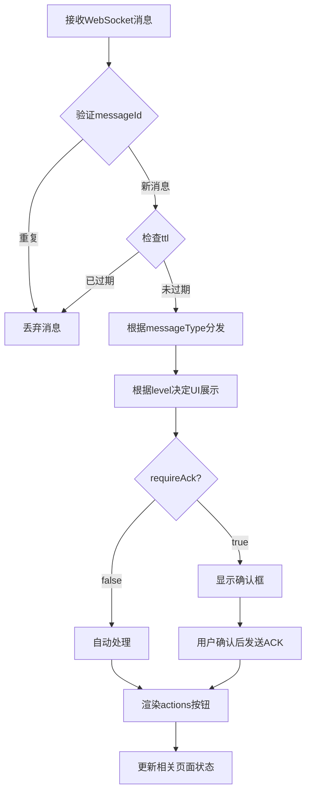

# WebSocket消息格式前端处理规范文档

## 📋 文档概述

本文档面向后端开发人员，详细说明前端对WebSocket消息的处理逻辑和要求。请严格按照本规范发送消息，确保前端能够正确处理和展示。

**适用范围**：云平台WebSocket实时通信  
**消息协议**：STOMP over WebSocket  
**消息格式**：统一Message结构  

---

## 🎯 前端支持的消息类型 (messageType)

### 1. TASK_PROGRESS - 任务进度更新
**前端处理逻辑**：更新任务进度条、状态显示、任务列表刷新

**payload要求**：
```json
{
  "taskId": "task-123456",           // 必填：任务ID
  "progress": 75,                    // 必填：进度百分比 (0-100)
  "status": "PROCESSING",            // 必填：任务状态 (PENDING/PROCESSING/COMPLETED/FAILED)
  "stage": "转码中",                  // 可选：当前阶段描述
  "estimatedTime": 120,              // 可选：预计剩余时间（秒）
  "result": null                     // 可选：完成时的结果数据
}
```

**建议配置**：
- level: INFO (进行中) / SUCCESS (完成) / ERROR (失败)
- priority: NORMAL
- ttl: 300000 (5分钟)

### 2. DEVICE_STATUS - 设备状态变更
**前端处理逻辑**：更新设备列表状态、设备详情页状态、设备监控面板

**payload要求**：
```json
{
  "deviceId": "dev-789012",          // 必填：设备ID
  "status": "ONLINE",                // 必填：设备状态 (ONLINE/OFFLINE/ERROR/MAINTENANCE)
  "lastHeartbeat": "2025-01-01T10:30:00Z", // 必填：最后心跳时间
  "cpuUsage": 45.6,                  // 可选：CPU使用率
  "memoryUsage": 62.3,               // 可选：内存使用率
  "temperature": 68.5,               // 可选：温度
  "errorCode": null                  // 可选：错误代码
}
```

### 3. FILE_UPLOAD - 文件上传状态
**前端处理逻辑**：更新文件上传进度、完成状态、文件列表刷新

**payload要求**：
```json
{
  "fileId": "file-345678",           // 必填：文件ID
  "fileName": "video.mp4",           // 必填：文件名
  "progress": 90,                    // 必填：上传进度 (0-100)
  "status": "UPLOADING",             // 必填：上传状态 (UPLOADING/COMPLETED/FAILED)
  "fileSize": 1048576,               // 必填：文件大小（字节）
  "uploadSpeed": 1024,               // 可选：上传速度（字节/秒）
  "downloadUrl": null                // 可选：完成后的下载地址
}
```

### 4. TRANSCODE_PROGRESS - 转码进度
**前端处理逻辑**：更新转码任务进度、转码队列状态

**payload要求**：
```json
{
  "transcodeId": "trans-901234",     // 必填：转码任务ID
  "sourceFileId": "file-345678",     // 必填：源文件ID
  "progress": 65,                    // 必填：转码进度 (0-100)
  "status": "TRANSCODING",           // 必填：转码状态
  "currentFormat": "1080p",          // 可选：当前转码格式
  "outputFiles": []                  // 可选：已完成的输出文件列表
}
```

### 5. COMMAND_FEEDBACK - 命令执行反馈
**前端处理逻辑**：更新终端命令状态、显示执行结果

**payload要求**：
```json
{
  "commandId": "cmd-567890",         // 必填：命令ID
  "terminalId": "term-123",          // 必填：终端ID
  "status": "COMPLETED",             // 必填：执行状态 (RUNNING/COMPLETED/FAILED/TIMEOUT)
  "exitCode": 0,                     // 必填：退出代码
  "output": "命令执行成功",            // 可选：输出内容
  "error": null,                     // 可选：错误信息
  "executionTime": 1500              // 可选：执行时间（毫秒）
}
```

### 6. SYSTEM_NOTIFICATION - 系统通知
**前端处理逻辑**：显示系统级通知、更新通知中心

**payload要求**：
```json
{
  "notificationId": "notify-111222", // 必填：通知ID
  "category": "MAINTENANCE",         // 必填：通知类别
  "targetUsers": ["all"],            // 可选：目标用户 (["all"] 表示全部用户)
  "validUntil": "2025-01-02T00:00:00Z", // 可选：通知有效期
  "link": "/system/maintenance"      // 可选：相关链接
}
```

### 7. USER_MESSAGE - 用户消息
**前端处理逻辑**：显示用户消息、更新未读计数、消息列表

**payload要求**：
```json
{
  "messageId": "msg-333444",         // 必填：消息ID
  "fromUserId": 20001,               // 必填：发送者用户ID
  "fromUserName": "张三",             // 必填：发送者姓名
  "messageType": "TEXT",             // 必填：消息类型 (TEXT/IMAGE/FILE)
  "content": "您好，请查看最新报告",    // 必填：消息内容
  "attachments": []                  // 可选：附件列表
}
```

---

## ⚡ 前端支持的操作类型 (actionType)

### 1. DOWNLOAD - 下载操作
```json
{
  "actionId": "download-file",
  "actionName": "下载文件",
  "actionType": "DOWNLOAD",
  "actionTarget": "/api/files/download/file-123456",
  "parameters": {
    "fileId": "file-123456",
    "fileName": "report.pdf"
  }
}
```
**前端处理**：直接触发浏览器下载

### 2. VIEW - 查看详情
```json
{
  "actionId": "view-task",
  "actionName": "查看任务详情",
  "actionType": "VIEW",
  "actionTarget": "/dashboard/program-management/task/task-123456",
  "parameters": {
    "taskId": "task-123456"
  }
}
```
**前端处理**：使用Next.js路由跳转到详情页

### 3. NAVIGATE - 页面导航
```json
{
  "actionId": "goto-device",
  "actionName": "查看设备",
  "actionType": "NAVIGATE", 
  "actionTarget": "/dashboard/devices",
  "parameters": {
    "deviceId": "dev-789012",
    "highlight": true
  }
}
```
**前端处理**：路由跳转并高亮显示指定设备

### 4. CONFIRM - 确认操作
```json
{
  "actionId": "confirm-delete",
  "actionName": "确认删除",
  "actionType": "CONFIRM",
  "actionTarget": "/api/tasks/delete/task-123456",
  "parameters": {
    "taskId": "task-123456",
    "confirmText": "确定要删除这个任务吗？"
  }
}
```
**前端处理**：显示确认对话框，用户确认后调用API

### 5. RETRY - 重试操作
```json
{
  "actionId": "retry-transcode",
  "actionName": "重新转码",
  "actionType": "RETRY",
  "actionTarget": "/api/transcode/retry/trans-901234",
  "parameters": {
    "transcodeId": "trans-901234"
  }
}
```
**前端处理**：调用重试API并显示处理结果

### 6. REFRESH - 刷新数据
```json
{
  "actionId": "refresh-list",
  "actionName": "刷新列表",
  "actionType": "REFRESH",
  "actionTarget": "/api/tasks/list",
  "parameters": {
    "scope": "task-list",
    "filters": {}
  }
}
```
**前端处理**：刷新指定范围的数据

---

## 🎨 字段处理规则

### level字段 - UI展示方式
| level | 前端处理 | 展示效果 | 自动消失时间 |
|-------|---------|---------|------------|
| SUCCESS | 绿色Toast通知 | 成功图标 + 绿色背景 | 3秒 |
| INFO | 蓝色Toast通知 | 信息图标 + 蓝色背景 | 5秒 |
| WARNING | 黄色Alert组件 | 警告图标 + 黄色背景 | 手动关闭 |
| ERROR | 红色Modal弹窗 | 错误图标 + 红色背景 | 必须确认 |

### priority字段 - 处理优先级
| priority | 前端处理 | 说明 |
|----------|---------|------|
| HIGH | 立即显示，可能伴随声音提示 | 紧急消息 |
| NORMAL | 正常队列处理 | 普通消息 |
| LOW | 延迟显示，可批量处理 | 非重要消息 |

### requireAck字段 - 确认机制
- `true`：必须显示Modal确认框，用户确认后前端发送ACK到 `/app/message/ack/{messageId}`
- `false`：自动处理，无需用户交互

### ttl字段 - 过期时间
- **建议范围**：60000ms - 3600000ms (1分钟 - 1小时)
- **前端处理**：消息过期后自动从UI中清理
- **特殊值**：0 表示永不过期（谨慎使用）

---

## 🔄 消息处理流程



---

## ⚠️ 后端开发注意事项

### 必填字段验证
```json
{
  "messageId": "必须全局唯一，建议使用UUID",
  "timestamp": "必须是ISO8601格式：2025-01-01T10:30:45.123Z",
  "oid": "必须与用户组织ID匹配",
  "messageType": "必须是前端支持的枚举值",
  "level": "必须是 SUCCESS/INFO/WARNING/ERROR 之一"
}
```

### 发送频率控制
- **建议频率**：同一用户每秒不超过10条消息
- **批量消息**：使用 `aggregate: true` 合并相似消息
- **进度消息**：建议每2-5秒发送一次，避免过于频繁

### 权限检查
- 确保消息只发送给有权限的用户
- 组织消息只发送给对应组织的用户
- 敏感信息不要通过WebSocket传输

### 错误处理
- 发送失败时记录日志
- 提供消息重发机制
- 监控消息发送成功率

---

## 🧪 测试建议

### 测试用例覆盖
1. **正常消息**：各种messageType的标准格式
2. **边界情况**：最大payload、特殊字符、空值处理
3. **异常情况**：格式错误、缺失字段、过期消息
4. **性能测试**：高频消息、大量并发用户

### 示例测试数据
```json
{
  "messageId": "test-msg-001",
  "timestamp": "2025-01-01T10:30:45.123Z",
  "oid": 10001,
  "messageType": "TASK_PROGRESS",
  "subType_1": "TRANSCODE",
  "level": "INFO",
  "context": {
    "resourceType": "TASK",
    "uid": 20002,
    "taskId": "task-test-001"
  },
  "title": "转码任务进度更新",
  "content": "您的视频转码进度已更新至75%",
  "payload": {
    "taskId": "task-test-001",
    "progress": 75,
    "status": "PROCESSING",
    "stage": "转码中"
  },
  "priority": "NORMAL",
  "requireAck": false,
  "ttl": 300000,
  "actions": [
    {
      "actionId": "view-task",
      "actionName": "查看详情",
      "actionType": "VIEW",
      "actionTarget": "/dashboard/program-management/task/task-test-001"
    }
  ]
}
```

---

## 🔄 版本兼容性

### 向后兼容原则
- ✅ 新增可选字段
- ✅ 新增messageType（需提前通知）
- ✅ 新增actionType（需提前通知）
- ❌ 删除现有必填字段
- ❌ 修改现有字段类型
- ❌ 修改现有枚举值

### 变更通知流程
1. 提前1周通知前端团队
2. 提供详细的变更说明
3. 提供测试环境验证
4. 确认前端兼容后再上线

---

## ❓ 常见问题FAQ

### Q1: 消息发送后前端没有反应？
**A**: 检查以下项目：
- messageId是否重复
- messageType是否在支持列表中
- oid是否与用户组织匹配
- 消息格式是否正确

### Q2: 进度消息应该多久发送一次？
**A**: 建议2-5秒发送一次，避免过于频繁影响前端性能

### Q3: 如何处理长时间运行的任务？
**A**: 使用合适的ttl值，定期发送进度更新，完成时发送最终状态

### Q4: actions按钮点击后没有响应？
**A**: 检查actionTarget是否是有效的API地址或路由

### Q5: 如何调试WebSocket消息？
**A**: 前端提供了STOMP测试工具，可以在 `/dashboard/stomp-test` 页面进行调试

---

**文档版本**: v1.0  
**最后更新**: 2025-01-01  
**联系人**: 前端开发团队