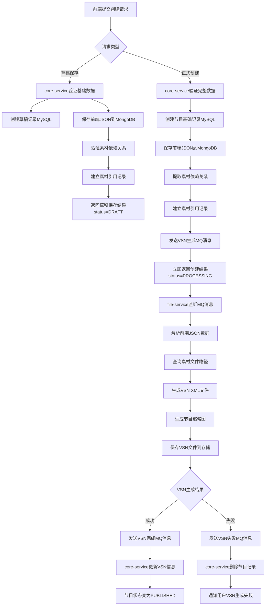
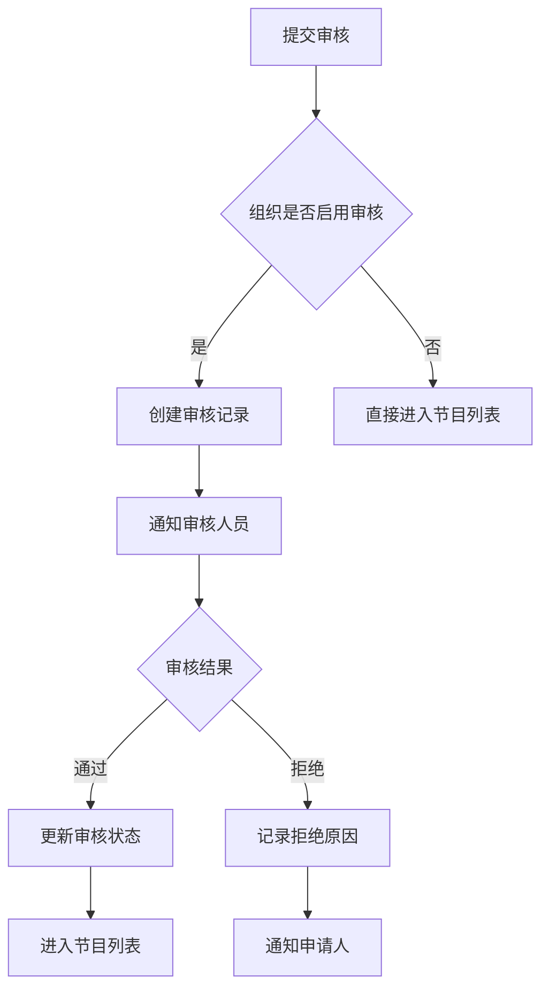
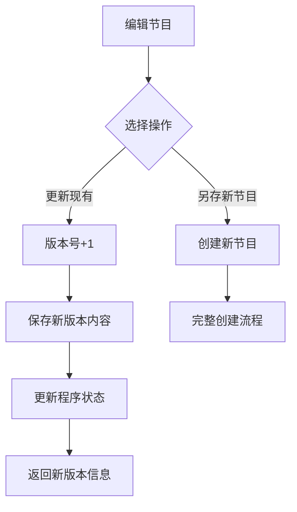

# 节目管理模块设计文档

## 1. 模块概述

### 1.1 背景
LED设备节目管理系统是云平台的核心功能模块，负责处理前端画布编辑生成的节目内容，转换为设备可识别的VSN格式，并提供完整的节目生命周期管理。

### 1.2 核心功能
- **节目创建与编辑**：基于已有素材通过前端画布编辑生成节目
- **VSN格式转换**：将前端JSON数据转换为标准VSN XML格式
- **版本控制**：支持节目版本递增管理和历史版本查看
- **审核工作流**：可配置的节目审批流程
- **终端发布**：支持发布到终端组或个别终端
- **状态管理**：草稿、已发布、待发布、模板等状态控制

## 2. 架构设计

### 2.1 微服务协作架构
```
┌─────────────────────────────────────────────────────────────────┐
│                        Frontend                                 │
└─────────────────────┬───────────────────────────────────────────┘
                      │
┌─────────────────────▼───────────────────────────────────────────┐
│                core-service (节目管理)                          │
│  ┌─────────────────────────────────────┐                       │
│  │           Controller Layer          │ ← RESTful API接口层    │
│  ├─────────────────────────────────────┤                       │
│  │            Service Layer            │ ← 业务逻辑层          │
│  ├─────────────────────────────────────┤                       │
│  │          Repository Layer           │ ← 数据访问层          │
│  └─────────────────────────────────────┘                       │
└─────────┬───────────────────┬───────────────────────────────────┘
          │                   │ RabbitMQ 异步消息
          │                   │
          │ ┌─────────────────▼─────────────────────────────────────┐
          │ │               file-service (VSN文件处理)            │
          │ │  ┌─────────────────────────────────────┐             │
          │ │  │         VSN Generation              │ ← VSN生成   │
          │ │  ├─────────────────────────────────────┤             │
          │ │  │       Thumbnail Generation          │ ← 缩略图    │
          │ │  ├─────────────────────────────────────┤             │
          │ │  │         Storage Service             │ ← 文件存储  │
          │ │  └─────────────────────────────────────┘             │
          │ └─────────────────────────────────────────────────────┘
          │
          ▼
┌─────────────────────────────────────────────────────────────────┐
│                    program-domain                               │
│              共享领域模型和数据契约                              │
│  ┌──────────────┐  ┌──────────────┐  ┌──────────────┐           │
│  │   Entity     │  │   Document   │  │     DTO      │           │
│  │  (MySQL映射)  │  │ (MongoDB映射) │  │  (API契约)   │           │
│  └──────────────┘  └──────────────┘  └──────────────┘           │
└─────────────────────────────────────────────────────────────────┘
                      │
                      ▼
┌─────────────────────────────────────────────────────────────────┐
│                  共享数据库                                      │
│  ┌──────────────┐  ┌──────────────┐  ┌──────────────┐           │
│  │    MySQL     │  │   MongoDB    │  │    Redis     │           │
│  │  (节目元数据) │  │ (JSON内容)   │  │   (缓存)     │           │
│  └──────────────┘  └──────────────┘  └──────────────┘           │
└─────────────────────────────────────────────────────────────────┘
```

### 2.2 program-domain模块定位

**作为共享依赖模块**：
- **目的**: 封装节目相关的复杂数据结构，避免重复定义
- **职责**: 纯数据模型，不包含业务逻辑
- **依赖方**: core-service、file-service等需要操作节目数据的服务
- **内容**: Entity、Document、DTO、Enum、VSN映射类

### 2.3 服务职责划分

#### 2.3.1 program-domain (共享领域模型)
**主要职责**：
- 定义节目相关的所有数据结构
- 提供VSN格式的完整对象模型  
- 统一API请求响应的数据契约
- 封装复杂的节目字段映射逻辑

**关键特性**：
- 零业务逻辑，纯数据模型
- 支持MySQL和MongoDB双存储
- 完整的VSN规范映射
- 为多个服务提供统一的数据视图

#### 2.3.2 core-service (节目管理服务)
**主要职责**：
- 节目元数据管理和业务流程控制
- 节目创建、编辑、审核等核心业务  
- 素材依赖关系管理和权限验证
- 版本控制和状态管理
- 草稿管理的完整业务逻辑

**关键特性**：
- 依赖program-domain获取数据模型
- 负责节目生命周期管理
- 处理前端JSON的验证和存储  
- 管理素材引用关系和权限
- 控制审核工作流程

#### 2.3.3 file-service (VSN文件处理服务)
**主要职责**：
- VSN XML文件生成和管理
- 节目缩略图生成
- 文件存储和访问管理
- 文件格式转换和处理

**关键特性**：
- 依赖program-domain获取VSN数据模型
- 基于MongoDB中的JSON生成标准VSN XML
- 异步处理VSN生成和缩略图
- 支持本地存储和云存储
- 遵循VSN格式规范确保设备兼容

### 2.3 核心组件设计

#### 2.3.1 版本控制管理器 (ProgramVersionManager)
**位置**：core-service
**职责**：管理节目版本
**关键特性**：
- 编辑时自动版本递增
- 版本历史查询和管理
- 支持版本回滚功能
- 最新版本显示逻辑

#### 2.3.2 审核工作流引擎 (ProgramApprovalWorkflow)
**位置**：core-service
**职责**：处理节目审核流程
**关键特性**：
- 组织级别审核配置
- 审核状态流转控制
- 审核记录追踪
- 可配置审核规则

#### 2.3.3 素材依赖管理器 (MaterialDependencyManager)
**位置**：core-service
**职责**：管理节目与素材的关系
**关键特性**：
- 提取节目中使用的素材ID
- 建立素材引用关系记录
- 验证素材存在性和权限
- 更新素材使用统计

#### 2.3.4 VSN生成引擎 (VsnGenerationEngine)
**位置**：file-service
**职责**：生成标准VSN XML文件
**关键特性**：
- 解析前端JSON数据结构
- 查询素材实际文件路径
- 构建符合规范的VSN XML
- 文件存储和版本管理

## 3. 数据模型设计

### 3.1 MySQL表结构

#### 3.1.1 节目基础信息表 (program)
```sql
CREATE TABLE program (
    id VARCHAR(32) PRIMARY KEY,
    name VARCHAR(200) NOT NULL COMMENT '节目名称',
    description TEXT COMMENT '节目描述',
    status ENUM('DRAFT','PUBLISHED','PENDING','TEMPLATE') DEFAULT 'DRAFT' COMMENT '节目状态',
    approval_status ENUM('PENDING','APPROVED','REJECTED') DEFAULT 'PENDING' COMMENT '审核状态',
    current_version INT DEFAULT 1 COMMENT '当前版本号（草稿状态不参与版本递增）',
    width INT NOT NULL COMMENT '节目宽度',
    height INT NOT NULL COMMENT '节目高度',
    duration BIGINT COMMENT '节目总时长(毫秒)',
    thumbnail_url VARCHAR(500) COMMENT '缩略图URL',
    usage_count INT DEFAULT 0 COMMENT '使用次数',
    
    -- VSN文件相关字段 (仅正式节目生成)
    vsn_file_id VARCHAR(64) COMMENT 'VSN文件ID',
    vsn_file_path VARCHAR(500) COMMENT 'VSN文件路径',
    vsn_generation_status ENUM('PENDING','PROCESSING','COMPLETED','FAILED') DEFAULT 'PENDING' COMMENT 'VSN生成状态',
    vsn_generation_error TEXT COMMENT 'VSN生成错误信息',
    
    -- 基础字段
    org_id VARCHAR(32) NOT NULL COMMENT '组织ID',
    created_time DATETIME DEFAULT CURRENT_TIMESTAMP,
    updated_time DATETIME DEFAULT CURRENT_TIMESTAMP ON UPDATE CURRENT_TIMESTAMP,
    created_by VARCHAR(32) NOT NULL,
    updated_by VARCHAR(32) NOT NULL,
    deleted TINYINT(1) DEFAULT 0,
    
    -- 索引
    INDEX idx_org_status (org_id, status),
    INDEX idx_created_time (created_time),
    INDEX idx_vsn_status (vsn_generation_status)
);
```

#### 3.1.2 节目素材引用表 (program_material_ref)
```sql
CREATE TABLE program_material_ref (
    id VARCHAR(32) PRIMARY KEY,
    program_id VARCHAR(32) NOT NULL,
    program_version INT NOT NULL,
    material_id VARCHAR(32) NOT NULL,
    material_type ENUM('IMAGE','VIDEO','AUDIO','TEXT') NOT NULL,
    usage_index INT DEFAULT 1 COMMENT '使用序号',
    vsn_path VARCHAR(200) COMMENT 'VSN中的路径',
    created_time DATETIME DEFAULT CURRENT_TIMESTAMP,
    created_by VARCHAR(32) NOT NULL,
    INDEX idx_program_version (program_id, program_version),
    INDEX idx_material (material_id)
);
```

#### 3.1.3 节目审核记录表 (program_approval)
```sql
CREATE TABLE program_approval (
    id VARCHAR(32) PRIMARY KEY,
    program_id VARCHAR(32) NOT NULL,
    program_version INT NOT NULL,
    status ENUM('PENDING','APPROVED','REJECTED') NOT NULL,
    applied_time DATETIME NOT NULL,
    reviewed_time DATETIME,
    reviewer_id VARCHAR(32),
    reviewer_name VARCHAR(100),
    review_comment TEXT,
    rejection_reason TEXT,
    org_id VARCHAR(32) NOT NULL,
    created_time DATETIME DEFAULT CURRENT_TIMESTAMP,
    updated_time DATETIME DEFAULT CURRENT_TIMESTAMP ON UPDATE CURRENT_TIMESTAMP,
    created_by VARCHAR(32) NOT NULL,
    INDEX idx_program_version (program_id, program_version),
    INDEX idx_status_org (status, org_id)
);
```

### 3.2 MongoDB文档结构

#### 3.2.1 节目内容文档 (program_contents)
```javascript
{
  "_id": ObjectId,
  "program_id": "节目ID",
  "version": "版本号",
  "information": {
    "width": "节目宽度",
    "height": "节目高度"
  },
  "pages": [
    {
      "loopType": "播放方式",
      "appointDuration": "页面时长",
      "bgColor": "背景色",
      "regions": [
        {
          "rect": {
            "x": "X坐标",
            "y": "Y坐标", 
            "width": "宽度",
            "height": "高度",
            "borderWidth": "边框宽度"
          },
          "items": [
            {
              "type": "素材类型",
              "fileSource": "文件源信息",
              "duration": "播放时长",
              // ... 其他VSN属性
            }
          ]
        }
      ]
    }
  ],
  "original_data": "前端原始JSON数据",
  "vsn_xml": "生成的VSN XML",
  "created_time": "创建时间",
  "updated_time": "更新时间",
  "created_by": "创建者",
  "updated_by": "更新者"
}
```

## 4. 接口设计

### 4.1 core-service API接口

#### 4.1.1 节目管理接口
```http
POST   /api/programs                    # 创建节目(触发异步VSN生成)
PUT    /api/programs/{id}              # 更新节目(触发异步VSN重新生成)
GET    /api/programs                   # 查询节目列表(支持VSN状态过滤)
GET    /api/programs/{id}/details      # 获取节目详情(包含前端JSON回显)
DELETE /api/programs/{id}              # 删除节目
GET    /api/programs/{id}/versions     # 获取版本历史
```

#### 4.1.2 审核流程接口
```http
POST   /api/programs/{id}/submit       # 提交审核
POST   /api/programs/{id}/approve      # 审核通过  
POST   /api/programs/{id}/reject       # 审核拒绝
GET    /api/programs/pending-approval  # 待审核列表
```

#### 4.1.3 草稿管理接口
```http
POST   /api/programs/draft             # 保存草稿
PUT    /api/programs/draft/{id}        # 更新草稿
GET    /api/programs/draft             # 查询草稿列表
GET    /api/programs/draft/{id}        # 获取草稿详情
DELETE /api/programs/draft/{id}        # 删除草稿
POST   /api/programs/draft/{id}/create # 基于草稿创建正式节目
```

#### 4.1.4 发布管理接口 (暂不实现)
```http
POST   /api/programs/{id}/publish      # 发布节目到终端
GET    /api/programs/{id}/publish-history # 发布历史查询
```

### 4.2 file-service 内部接口 (不对外暴露)

#### 4.2.1 VSN处理接口 (消息队列触发)
```http
# 内部消息处理，不提供REST接口
MQ: program.vsn.generate.request       # 处理VSN生成请求消息
MQ: program.vsn.generate.completed     # 发送VSN生成完成消息
```

#### 4.2.2 存储管理接口 (内部调用)
```http
# 内部服务调用，不对外暴露
saveVsnFile(programId, vsnContent)         # 保存VSN文件到存储
generateThumbnail(programJson)             # 生成节目缩略图
```

## 5. 业务流程设计

### 5.1 节目创建流程 (微服务协作版)


### 5.2 节目审核流程


### 5.3 版本控制流程


## 6. 状态管理和特殊业务规则

### 6.1 DRAFT状态特殊处理规则

#### 6.1.1 草稿状态的触发场景
- **场景1**: 用户在前端编辑节目，未点击"创建"按钮直接返回
- **场景2**: 前端弹窗询问用户是否保存为草稿，用户确认保存

#### 6.1.2 草稿状态的数据完整性要求
- **素材依赖验证**: 必须验证，确保引用的素材存在且可访问
- **VSN必需字段**: 必须完整，确保后续能正确生成VSN
- **版本控制**: 草稿不参与版本递增，无版本号概念
- **生命周期**: 用户主动删除，无自动过期机制

#### 6.1.3 草稿转正式节目流程
1. 前端使用草稿数据调用正式节目创建接口
2. Core-Service创建正式节目记录（分配版本号）
3. 触发VSN生成流程
4. VSN生成成功后，前端调用删除草稿接口
5. VSN生成失败时，删除正式节目记录，保留草稿

#### 6.1.4 草稿与正式节目的区别
| 特性 | 草稿状态 | 正式节目 |
|------|---------|---------|
| 版本号 | 无 | 有，从1开始递增 |
| VSN生成 | 否 | 是 |
| 审核流程 | 不涉及 | 可选 |
| 预览功能 | 返回JSON | 返回JSON |
| 素材依赖保护 | 是 | 是 |

### 6.2 素材依赖保护机制
基于现有业务规则：如果素材被制作成节目，该素材不能被删除。此规则同样适用于草稿状态。

### 6.3 失败处理策略
- **VSN生成失败**: 删除节目记录，推送失败通知
- **草稿保存失败**: 直接删除，无需回滚
- **网络中断**: 前端重新请求，后端删除不完整数据

## 7. 关键技术实现

### 6.1 微服务通信机制
- **消息队列**：使用RabbitMQ实现异步VSN生成
- **事件驱动**：基于领域事件的服务间协作
- **数据一致性**：共享数据库保证最终一致性
- **错误恢复**：支持消息重试和失败处理

### 6.2 VSN生成算法 (file-service)
- **JSON解析**：使用Jackson解析前端数据结构
- **素材路径查询**：直接访问共享数据库获取素材信息
- **数据映射**：将前端结构映射到标准VSN对象模型  
- **XML生成**：使用DOM API构建符合规范的VSN XML
- **格式验证**：严格按照VSN格式要求进行验证

### 6.3 版本控制策略 (core-service)
- **版本递增**：每次编辑操作自动递增版本号
- **数据存储**：MySQL存储元数据，MongoDB存储版本内容
- **历史保存**：保留所有版本的完整JSON数据和VSN文件
- **最新版本查询**：通过MAX(current_version)获取最新版本
- **VSN同步**：版本变更时触发VSN重新生成

### 6.4 异步处理机制
- **VSN生成**：异步处理，避免前端长时间等待
- **缩略图生成**：异步生成多尺寸预览图
- **状态跟踪**：实时更新VSN生成状态
- **错误处理**：失败时记录详细错误信息

### 6.5 审核工作流 (core-service)
- **配置化设计**：支持组织级别的审核开关配置
- **状态机模式**：清晰的审核状态流转逻辑
- **权限控制**：基于角色和组织的审核权限
- **审核记录**：完整的审核历史和意见记录

## 7. 性能与安全考虑

### 7.1 性能优化
- **数据库索引**：关键字段创建适当索引
- **缓存策略**：VSN内容缓存，避免重复生成
- **分页查询**：大数据量列表使用分页
- **异步处理**：耗时操作异步化

### 7.2 安全措施
- **数据验证**：严格的输入参数验证
- **权限控制**：基于组织和角色的访问控制
- **审计日志**：记录关键操作日志
- **敏感数据**：适当的数据脱敏处理

## 8. 扩展性设计

### 8.1 插件化架构
- **VSN生成器插件化**：支持新的VSN类型扩展
- **审核流程插件化**：支持自定义审核规则
- **发布策略插件化**：支持不同的发布策略

### 8.2 微服务化准备
- **接口标准化**：使用标准的RESTful API
- **数据库分离**：程序数据与其他模块解耦
- **配置外部化**：支持外部配置管理