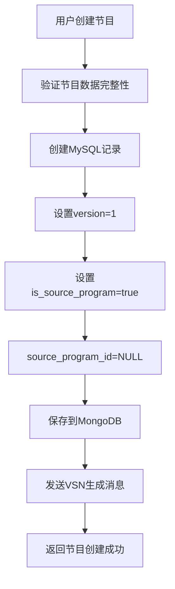
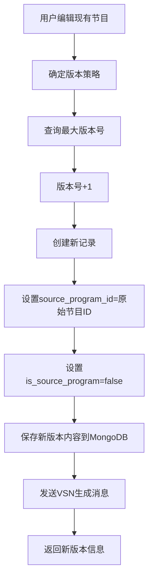
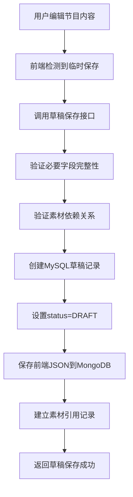
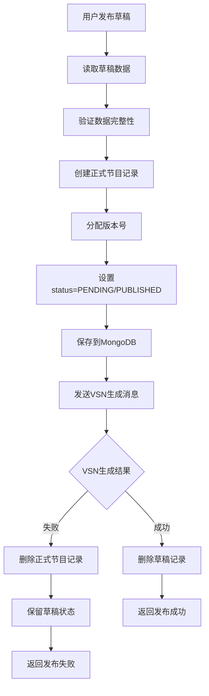
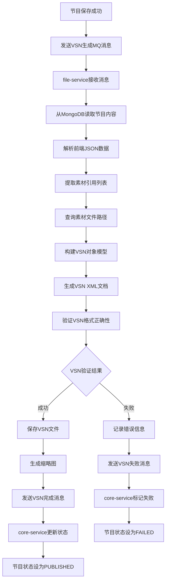
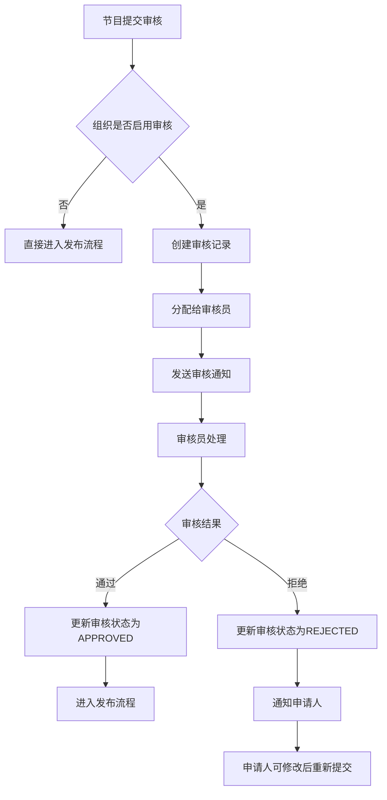
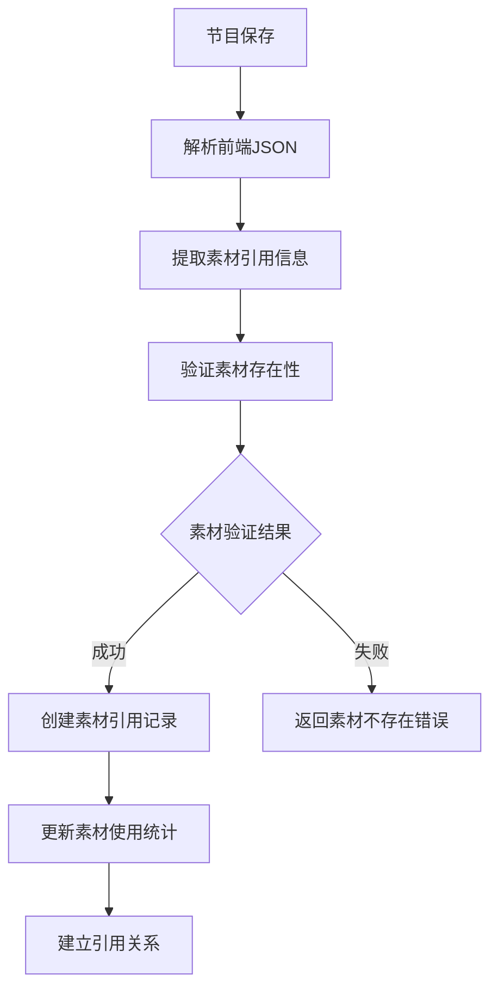

# 节目管理模块业务流程详细说明

## 1. 概述

本文档详细说明节目管理模块的核心业务流程，重点描述版本控制机制、草稿管理策略和VSN生成流程。所有设计均以**LED设备管理**为核心，确保版本控制服务于设备的实际使用需求。

## 2. 版本控制业务流程

### 2.1 版本控制核心理念

**以设备管理为中心的版本控制**：
- 每个版本都是独立的完整节目记录
- 设备可以选择使用任意版本的节目
- 版本历史完整保存，支持设备回滚
- 通过版本链提供直观的版本管理体验

### 2.2 版本创建流程

#### 2.2.1 新节目创建（版本1）


**关键字段设置**：
- `version = 1`：标识为原始版本
- `source_program_id = NULL`：原始节目不需要关联
- `is_source_program = true`：标识为版本链的起点

#### 2.2.2 编辑创建新版本（版本N+1）


**版本链示例**：
```sql
-- 原始节目：节目A v1
INSERT INTO program (id, name, version, source_program_id, is_source_program) 
VALUES (1, '节目A', 1, NULL, true);

-- 编辑后创建新版本：节目A v2  
INSERT INTO program (id, name, version, source_program_id, is_source_program)
VALUES (5, '节目A', 2, 1, false);

-- 再次编辑：节目A v3
INSERT INTO program (id, name, version, source_program_id, is_source_program)
VALUES (9, '节目A', 3, 1, false);
```

### 2.3 版本查询策略

#### 2.3.1 查询版本链的所有版本
```sql
-- 查询节目ID为1的所有版本（包括原始版本）
SELECT * FROM program 
WHERE (source_program_id = 1 OR (id = 1 AND is_source_program = true))
ORDER BY version ASC;
```

#### 2.3.2 查询最新版本
```sql
-- 查询节目ID为1的最新版本
SELECT * FROM program 
WHERE (source_program_id = 1 OR (id = 1 AND is_source_program = true))
ORDER BY version DESC LIMIT 1;
```

#### 2.3.3 查询指定版本
```sql
-- 查询节目A的版本2
SELECT * FROM program 
WHERE (source_program_id = 1 OR (id = 1 AND is_source_program = true))
AND version = 2;
```

### 2.4 设备版本管理应用场景

#### 2.4.1 设备选择性更新
- 设备当前播放节目A v1
- 后台发布节目A v2
- 设备可以选择：
  - 立即更新到v2
  - 延迟更新（继续播放v1）
  - 拒绝更新（保持v1）

#### 2.4.2 设备版本回滚
- 设备当前播放节目A v3
- 发现v3存在问题
- 设备可以回滚到：
  - 节目A v2（上一版本）
  - 节目A v1（原始版本）

#### 2.4.3 多设备版本管理
- 设备A播放节目X v1
- 设备B播放节目X v2  
- 设备C播放节目X v3
- 通过版本控制实现不同设备的个性化内容管理

## 3. 草稿管理业务流程

### 3.1 草稿状态的特殊性

**草稿与正式节目的关键区别**：
- 草稿不分配版本号
- 草稿不触发VSN生成
- 草稿不参与版本链管理
- 草稿可以转换为正式节目

### 3.2 草稿保存流程



**关键业务规则**：
- 草稿必须包含完整的VSN必需字段
- 草稿必须验证素材依赖关系
- 草稿触发素材保护机制（被引用的素材不能删除）

### 3.3 草稿转正式节目流程



### 3.4 草稿管理的用户体验设计

#### 3.4.1 自动保存策略
- 用户编辑过程中每30秒自动保存草稿
- 用户离开页面时提醒保存草稿
- 草稿保存失败时显示明确的错误信息

#### 3.4.2 草稿恢复机制
- 用户再次编辑时自动加载最新草稿
- 支持草稿预览功能
- 支持基于草稿创建多个正式节目

## 4. VSN生成业务流程

### 4.1 异步VSN生成设计原理

**异步处理的必要性**：
- VSN生成涉及复杂的XML构建
- 需要查询多个素材的实际文件路径
- 生成过程可能耗时较长（特别是大型节目）
- 避免前端长时间等待，提升用户体验

### 4.2 VSN生成完整流程



### 4.3 VSN数据映射规则

#### 4.3.1 前端JSON到VSN XML的映射
```javascript
// 前端JSON结构
{
  "information": {"width": 1920, "height": 1080},
  "pages": [{
    "loopType": "manual",
    "appointDuration": 5000,
    "regions": [{
      "rect": {"x": 0, "y": 0, "width": 1920, "height": 1080},
      "items": [{
        "type": "IMAGE",
        "fileSource": {"materialId": 456, "filePath": "/materials/bg.jpg"},
        "duration": 5000
      }]
    }]
  }]
}
```

转换为VSN XML：
```xml
<Programs>
  <Program>
    <Information>
      <Width>1920</Width>
      <Height>1080</Height>
    </Information>
    <Pages>
      <Page>
        <LoopType>0</LoopType>
        <AppointDuration>5000</AppointDuration>
        <Regions>
          <Region>
            <Rect>
              <X>0</X><Y>0</Y>
              <Width>1920</Width><Height>1080</Height>
              <BorderWidth>0</BorderWidth>
            </Rect>
            <Items>
              <Item>
                <Type>2</Type>
                <FileSource>
                  <IsRelative>0</IsRelative>
                  <FilePath>/materials/bg.jpg</FilePath>
                </FileSource>
                <Duration>5000</Duration>
              </Item>
            </Items>
          </Region>
        </Regions>
      </Page>
    </Pages>
  </Program>
</Programs>
```

### 4.4 VSN生成状态管理

**状态枚举**：
- `PENDING`：等待生成
- `PROCESSING`：正在生成
- `COMPLETED`：生成成功
- `FAILED`：生成失败

**状态变更规则**：
1. 节目创建时：`status = PENDING`
2. file-service开始处理：`status = PROCESSING`  
3. 生成成功：`status = COMPLETED` + 保存文件路径
4. 生成失败：`status = FAILED` + 记录错误信息

## 5. 审核工作流业务流程

### 5.1 组织级审核配置

**审核策略分类**：
- **无审核**：节目创建后直接发布
- **简单审核**：指定审核员审核
- **多级审核**：按角色层级审核

### 5.2 审核流程设计



### 5.3 审核权限设计

**权限级别**：
- **普通用户**：只能提交审核申请
- **审核员**：可以审核指定用户组的节目
- **管理员**：可以审核所有节目

**权限验证规则**：
- 审核员只能审核自己权限范围内的节目
- 节目创建者不能审核自己的节目
- 审核记录完整保存，支持审核历史追溯

## 6. 素材依赖管理业务流程

### 6.1 素材依赖建立



### 6.2 素材保护机制

**保护规则**：
- 被节目引用的素材不能删除
- 删除素材前检查所有引用关系
- 支持查询素材的使用情况

### 6.3 素材使用统计

**统计维度**：
- 素材被多少个节目使用
- 素材在每个节目中的使用次数
- 素材的总使用频率

## 7. 错误处理和恢复策略

### 7.1 VSN生成失败处理

**失败场景**：
- 素材文件不存在或损坏
- JSON格式不符合VSN规范  
- XML生成过程中出现异常
- 文件存储服务不可用

**恢复策略**：
- 记录详细错误信息
- 支持手动重新生成VSN
- 提供VSN生成状态查询
- 失败时保留原始节目数据

### 7.2 数据一致性保证

**一致性策略**：
- MySQL和MongoDB通过事务性消息保证最终一致性
- VSN生成失败时回滚节目状态
- 素材引用关系异常时阻止节目创建

### 7.3 系统监控和告警

**监控指标**：
- VSN生成成功率
- 平均VSN生成时间
- 素材依赖验证失败率
- 审核流程处理时效

**告警机制**：
- VSN生成连续失败告警
- 素材服务不可用告警
- 审核流程超时告警

## 8. 性能优化策略

### 8.1 缓存策略

**多级缓存**：
- Redis缓存热门节目信息
- 本地缓存素材路径信息
- VSN文件CDN缓存

### 8.2 异步处理优化

**队列优化**：
- VSN生成使用专用队列
- 支持优先级队列（紧急节目优先）
- 批量处理相似节目的VSN生成

### 8.3 数据库优化

**索引策略**：
- 版本链查询优化索引
- 素材依赖关系索引
- 审核状态查询索引

## 9. 扩展性设计

### 9.1 插件化VSN生成器

**扩展点**：
- 支持多种VSN格式版本
- 支持自定义VSN模板
- 支持特殊设备的VSN定制

### 9.2 工作流引擎集成

**扩展能力**：
- 支持复杂审核流程配置
- 支持审核流程可视化设计
- 支持外部审核系统集成

### 9.3 设备管理集成

**集成接口**：
- 节目版本推送到设备
- 设备版本状态回报
- 设备版本回滚支持

---

本文档为节目管理模块的核心业务流程提供了详细说明，重点突出了版本控制、草稿管理、VSN生成等关键流程的设计理念和实现方案。所有设计均以LED设备管理为核心，确保系统能够满足实际的设备运营需求。