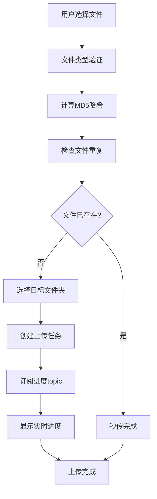

# 文件上传功能实现说明

## 功能概述

本次实现了完整的文件上传功能，支持单个文件上传、MD5去重检查、异步上传任务管理和WebSocket实时进度监听。

## 主要特性

- ✅ **单个文件上传**：支持拖拽和点击选择
- ✅ **文件类型验证**：基于服务端配置动态验证
- ✅ **MD5去重检查**：避免重复上传，支持秒传
- ✅ **目标文件夹选择**：复用素材管理树结构
- ✅ **实时进度监听**：通过WebSocket订阅任务进度
- ✅ **完整状态管理**：上传状态、进度、结果反馈
- ✅ **全局WebSocket集成**：使用页面级订阅模式

## 技术架构

### 核心组件

1. **useFileUpload Hook** (`hooks/useFileUpload.ts`)
   - 文件上传状态管理
   - WebSocket进度监听
   - API调用封装

2. **FolderSelector** (`components/FolderSelector.tsx`)
   - 文件夹选择组件
   - 复用素材管理树结构
   - 支持用户组和文件夹选择

3. **UploadProgress** (`components/UploadProgress.tsx`)
   - 进度显示组件
   - 状态反馈界面
   - 操作按钮管理

4. **FileUploadAPI** (`lib/api/fileUpload.ts`)
   - 文件服务API调用
   - 工具函数集合
   - 类型验证逻辑

### API集成

- **文件服务前缀**: `/file/api`（通过网关访问）
- **完整路径格式**: `/file/api/file` + API文档路径（例如：`/file/api/file/upload/supported-types`）
- **任务进度订阅**: `/topic/task/{taskId}`
- **素材树接口**: `/core/api/material/tree/init`

### WebSocket集成

使用现有的全局WebSocket连接：
- 页面级订阅模式（`subscriptionManager.subscribeForPage`）
- 自动生命周期管理
- 路由变化时自动清理订阅

## 上传流程



## 使用方法

### 基本使用

```tsx
import { useFileUpload } from '@/hooks/useFileUpload'

function MyUploadComponent() {
  const {
    status,
    progress,
    result,
    error,
    supportedTypes,
    initializeUpload,
    uploadFile,
    cancelUpload,
    resetUpload
  } = useFileUpload('/my-page-path')

  // 初始化
  useEffect(() => {
    initializeUpload()
  }, [])

  // 上传文件
  const handleUpload = async (file: File) => {
    await uploadFile(file, {
      folderId: 'folder-123',
      materialName: '我的素材',
      description: '素材描述'
    })
  }
}
```

### 页面实现

访问 `/dashboard/file-management/upload` 查看完整实现。

## 消息格式

根据WebSocket消息格式规范，上传进度消息格式如下：

```json
{
  "messageId": "task-progress-001",
  "timestamp": "2025-01-01T10:30:45.123Z",
  "oid": 10001,
  "messageType": "TASK_PROGRESS",
  "subType_1": "FILE_UPLOAD",
  "level": "INFO",
  "context": {
    "resourceType": "TASK",
    "taskId": "upload-task-001"
  },
  "title": "文件上传进度",
  "content": "文件上传进度已更新至75%",
  "payload": {
    "taskId": "upload-task-001",
    "progress": 75,
    "uploadedSize": 7500000,
    "totalSize": 10000000,
    "uploadSpeed": 500000,
    "estimatedTimeRemaining": 5,
    "status": "UPLOADING"
  }
}
```

## 配置要求

### 后端配置

1. **文件服务API**：确保文件服务正常运行
2. **WebSocket支持**：STOMP over WebSocket
3. **权限配置**：网关路由和权限设置

### 前端依赖

- Next.js 应用路由
- 全局WebSocket连接
- 素材管理API
- UI组件库（shadcn/ui + Ant Design）

## 注意事项

- 当前版本仅支持单个文件上传
- 不支持自动转码功能（后续开发）
- MD5计算使用简化算法（生产环境建议使用crypto-js）
- 依赖全局WebSocket连接状态

## 后续优化

1. **批量上传支持**
2. **断点续传功能** 
3. **真正的MD5计算**
4. **上传队列管理**
5. **预览功能集成**
6. **转码任务集成**

## 问题排查

### 常见问题

1. **上传无响应**：检查WebSocket连接状态
2. **进度不更新**：确认topic订阅成功
3. **文件验证失败**：检查文件类型配置
4. **文件夹选择失败**：确认素材树API正常

### 调试工具

- 使用 `/dashboard/stomp-debug` 页面调试WebSocket
- 查看浏览器控制台日志
- 检查网络请求状态

---

文档更新时间：2025-01-01
版本：v1.0.0